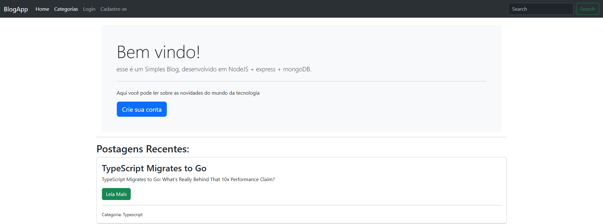
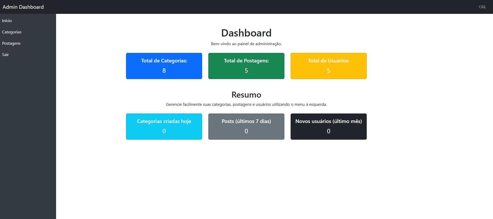

# 📚 Projeto Node.js MongoDB

Este é um projeto de aplicação web desenvolvido em **Node.js**, utilizando **Express**, **MongoDB** e **Mongoose**. O objetivo é demonstrar a criação de um sistema de postagens com autenticação de usuários e área administrativa.

---

## 🚀 Funcionalidades

✅ Cadastro de Usuários  
✅ Login com autenticação usando **Passport.js**  
✅ Hash de senhas com **bcrypt**  
✅ Área Administrativa protegida por permissões  
✅ Criação e edição de categorias e postagens  
✅ Sistema de flash messages (mensagens de feedback)  
✅ Templates dinâmicos com **Handlebars**  
✅ Validação de dados do formulário  
✅ Estrutura MVC organizada

---

## 🛠 Tecnologias Utilizadas

- **Node.js**
- **Express**
- **MongoDB**
- **Mongoose**
- **Passport.js**
- **bcrypt**
- **express-session**
- **Handlebars**
- **Bootstrap 5**

---

## ⚙️ Instalação

git clone https://github.com/LukeRobs/node-mongo-blog.git
cd node-mongo-blog
npm install

# Configure seu banco de dados MongoDB (local ou Atlas) no app.js:
mongoose.connect()

# Inicie o servidor:
NPM start

# Acesse no navegador:
http://localhost:PORTA

## 📂 Estrutura de Pastas
.
├── config          # Configurações (passport, autenticação)
├── helpers         # Helpers para Handlebars
├── models          # Modelos do Mongoose
├── routes          # Rotas da aplicação
├── views           # Templates Handlebars
├── public          # Arquivos estáticos (CSS, JS)
├── app.js          # Arquivo principal da aplicação

## 🔒 Segurança

 🔐 Senhas criptografadas
 ⚠️ Validação de campos
 🚫 Proteção de rotas administrativas

## ✨ Demonstração

   🏠 Página Inicial
    

   📝 Lista de Postagens
    

     Painel ADM Dashboard 
    
    
# 📄 Licença
Este projeto está licenciado sob a MIT License.

# ✉️ Contato
Se quiser trocar uma ideia ou tirar dúvidas:

LinkedIn: lucas-robson-dev/

E-mail: lucassrobson07@gmail.com
